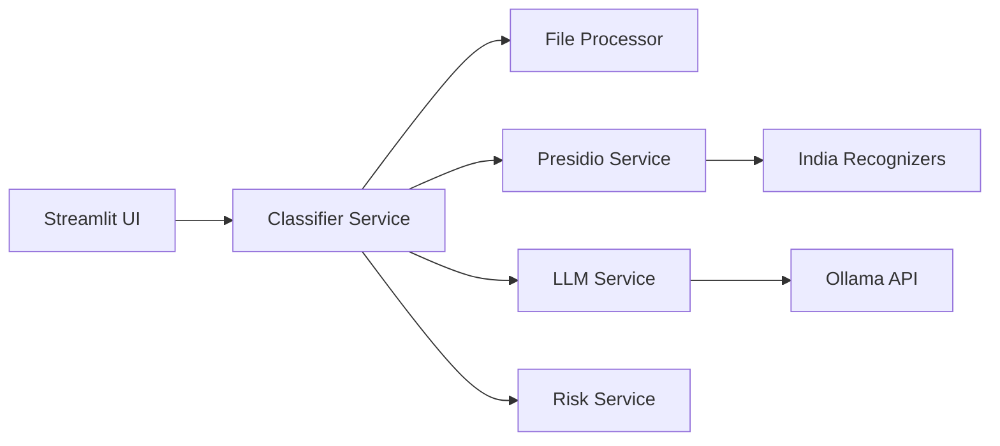

# ADC Architecture

## System diagram

## Pipeline

1. **Upload** — User selects file and analysis options in Streamlit sidebar.
2. **Detect type** — CSV/XLSX → structured; TXT/PDF/DOCX → unstructured.
3. **Extract** — Pandas, openpyxl, pypdf, python-docx.
4. **Presidio** — Candidate entities via built-in + custom Aadhaar/PAN recognizers.
5. **LLM validation** — Ollama validates context; returns strict JSON.
6. **Fallback** — Column-name heuristics + Presidio scores if LLM fails.
7. **Risk** — Weighted score from NPPI volume and sensitive entity types.
8. **UI** — Metrics, table, chart, preview, reasoning JSON.

## Classification logic

### Structured (column-level)

For each column:

- Sample non-null values
- Run Presidio on values and column metadata text
- LLM classifies column using name + samples + entity hints
- Fallback: keyword heuristics on column name

### Unstructured (entity-level)

- Extract full document text
- Presidio entity spans
- Context window around each span
- LLM batch validation with document excerpt
- Fallback: map Presidio entity type → NPPI tier

## NPPI tiers

| Tier | Examples |
|------|----------|
| NPPI | PERSON, PHONE_NUMBER, EMAIL_ADDRESS, LOCATION |
| SENSITIVE_NPPI | IN_AADHAAR, IN_PAN, CREDIT_CARD, US_PASSPORT |
| NON_NPPI | Product ID, SKU, order ID, inventory counts |

## Risk scoring

Factors:

- Count of NPPI and SENSITIVE_NPPI findings
- Presence of Aadhaar/PAN/payment identifiers
- Multiple entity categories
- High volume thresholds

Output: `risk_score` (0–100) and `risk_level`.

## Resilience

- Invalid LLM JSON → repair attempt → heuristic fallback
- Ollama down → warning + Presidio/heuristics only
- PDF extraction failure → user-visible error, no crash
